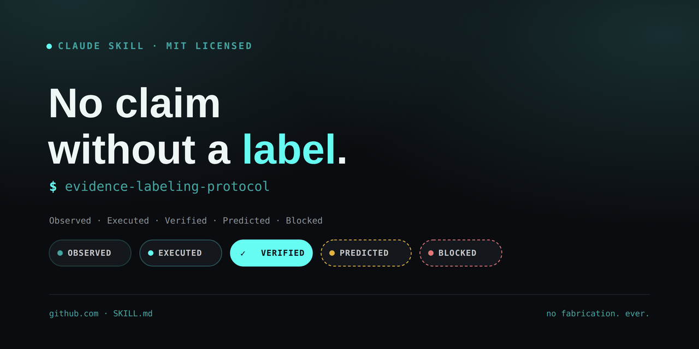
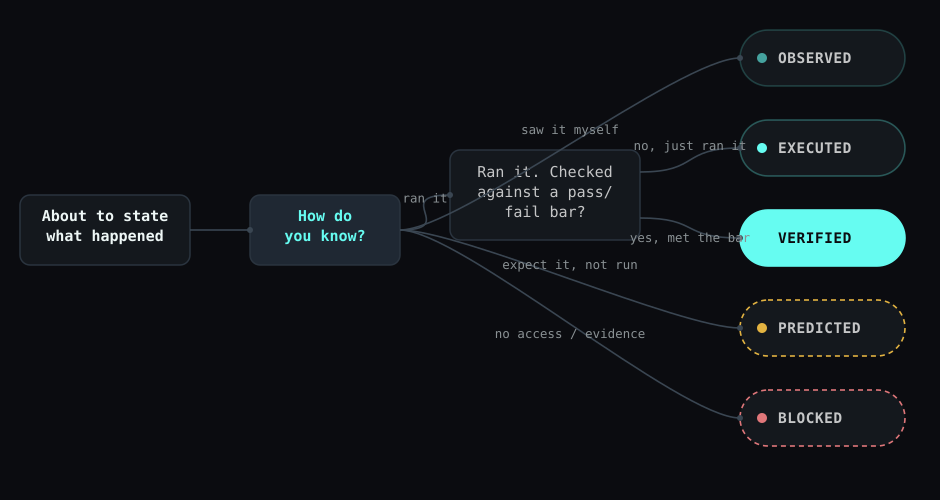

  

  
  
  

# Evidence Labeling Protocol

A Claude Skill that replaces confident-sounding, unearned claims with a strict five-label evidence taxonomy: **Observed, Executed, Verified, Predicted, Blocked.**

It stops an agent from saying "tests passed" or "deployment is live" unless that's literally what happened.

## Why this exists

Most public skills wrap a specific tool: a formatter, an API client, a task runner. This one doesn't wrap anything. It's a portable behavioral constraint that applies to any agent output: status reports, PR reviews, security audits, incident writeups, changelog entries. The failure mode it fixes, an AI stating something happened without having actually checked, isn't tied to a stack, a language, or a vertical.

It's also harder to copy well than it looks. Writing "don't fabricate results" in a prompt is one line. Enforcing an actual taxonomy, consistently, across every claim in a response, so that "not run" is never silently dressed up as "passed", is a discipline, not a slogan.

## The five labels

| Label | Meaning |
|---|---|
| **Observed** | Directly inspected: you read the file, saw the output, viewed the screen |
| **Executed** | A command ran and its raw result is available |
| **Verified** | The result was checked against a defined pass/fail bar, not just eyeballed |
| **Predicted** | Expected result, not yet run |
| **Blocked** | Can't proceed with current access or evidence |

## How it works

  

Two hard rules do most of the work:

1. **No success claim without literal output.** "Clean," "verified," "passed," and "secure" never appear without the evidence that earned them, in the same sentence or the same table row.
2. **"Clean" requires a control.** A security scan, audit, or test suite is never called clean without a known-positive control (something planted that should trigger a finding) and at least two independent detection methods. A scanner that finds nothing because it's broken looks identical to one that finds nothing because there's nothing there.

The full rule set, including the output template and worked good-vs-bad examples, is in [`SKILL.md`](SKILL.md).

## Install

**Claude Code:** copy this folder into `.claude/skills/evidence-labeling-protocol/` in your project (or your personal skills directory).

**Claude.ai:** upload `SKILL.md` directly if your workspace supports skill upload, or paste its contents into a project's custom instructions.

## Example

**Without the skill:**
> Ran the test suite and deployed to staging. Everything's passing and the site is live.

**With the skill:**
> Executed: `pytest` returned 38/38 passed. Verified: staging URL returns 200 with the expected commit hash. Predicted: production deploy not yet run, awaiting approval.

## License

MIT. See [LICENSE](LICENSE).
